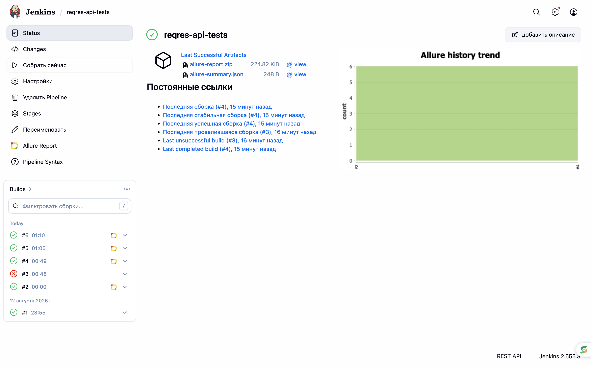
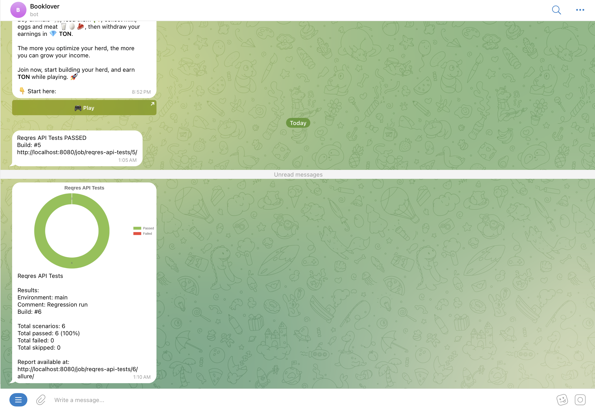

# API Test Automation Project [Reqres.in](https://reqres.in)

<p align="center">
  
</p>

---

## Contents

* [Description](#description)
* [Technologies and Tools](#technologies-and-tools)
* [Implemented Tests](#implemented-tests)
* [Project Structure](#project-structure)
* [Running Tests](#running-tests)
* [Jenkins CI](#jenkins-ci)
* [Allure Report](#allure-report)

    * [Allure Overview](#allure-overview)
    * [Test Details](#test-details)
* [Telegram Notifications](#telegram-notifications)
* [API Key](#api-key)

---

## Description

Reqres API Test Automation is a project for automated testing of the REST API provided by [reqres.in](https://reqres.in).

The project covers the main user-related API operations: creating, retrieving, updating and deleting users, as well as negative scenarios.

### Project Features

* API tests written in `Java`
* HTTP requests and response validation using `REST Assured`
* Test execution with `JUnit 5`
* Project build and dependency management with `Gradle`
* Request and response models using `Lombok`
* JSON serialization and deserialization using `Jackson`
* Reusable `RequestSpecification` and `ResponseSpecification`
* Positive and negative API scenarios
* `Allure REST Assured` listener
* Custom `FreeMarker` templates for HTTP request and response attachments
* Allure metadata:

    * Epic
    * Feature
    * Story
    * Severity
    * Owner
* Automated execution through `Jenkins`
* Secrets stored in `Jenkins Credentials`
* Automatic Allure Report generation
* Automatic Telegram notifications after Jenkins builds
* Test statistics and result chart sent to Telegram

---

## Technologies and Tools

<p align="center">
  
  &nbsp;&nbsp;
  
  &nbsp;&nbsp;
  
  &nbsp;&nbsp;
  
  &nbsp;&nbsp;
  
  &nbsp;&nbsp;
  
</p>

<p align="center">
  <b>REST Assured</b> •
  <b>JUnit 5</b> •
  <b>Allure Report</b> •
  <b>Lombok</b> •
  <b>Jackson</b> •
  <b>FreeMarker</b> •
  <b>Telegram Bot API</b>
</p>

---

## Implemented Tests

The project contains automated tests for the main Reqres user API operations.

* `POST /users`

    * Create a new user
    * Validate `201 Created`
    * Deserialize response into DTO

* `GET /users`

    * Get users list
    * Validate response status
    * Deserialize users collection

* `GET /users/2`

    * Get a single user
    * Validate user information

* `GET /users/99999`

    * Request a non-existing user
    * Validate `404 Not Found`

* `PUT /users/2`

    * Update user information
    * Validate updated response

* `DELETE /users/2`

    * Delete user
    * Validate `204 No Content`

### Current Test Suite

```text
Total tests: 6
Passed: 6
Failed: 0
```

---

## Project Structure

```text
reqres-api-tests
├── images
│   ├── reqres.png
│   ├── allure-overview.png
│   ├── allure-test-details.png
│   ├── jenkins-allure.png
│   └── telegram-report.png
│
├── src
│   └── test
│       ├── java
│       │   └── qa
│       │       └── guru
│       │           └── reqres
│       │               ├── models
│       │               │   ├── CreateUserRequestDto.java
│       │               │   ├── CreateUserResponseDto.java
│       │               │   ├── UpdateUserRequestDto.java
│       │               │   ├── UpdateUserResponseDto.java
│       │               │   ├── UserDto.java
│       │               │   └── UserSearchResponseDto.java
│       │               │
│       │               ├── specs
│       │               │   └── ReqresSpec.java
│       │               │
│       │               └── tests
│       │                   └── ReqresApiTests.java
│       │
│       └── resources
│           ├── tpl
│           │   ├── request.ftl
│           │   └── response.ftl
│           │
│           └── allure.properties
│
├── Jenkinsfile
├── build.gradle
├── gradlew
├── gradlew.bat
├── settings.gradle
└── README.md
```

---

## Running Tests

### Local Test Execution

Before running the tests, configure the Reqres API key:

```bash
export REQRES_API_KEY=YOUR_API_KEY
```

Run all tests:

```bash
./gradlew clean test
```

### Generate Allure Report

```bash
./gradlew allureReport
```

### Open Allure Report

```bash
./gradlew allureServe
```

---

## Jenkins CI

The project is integrated with Jenkins.

The pipeline is described in:

```text
Jenkinsfile
```

### Jenkins Pipeline Flow

```text
GitHub
   ↓
Jenkins
   ↓
Checkout
   ↓
Gradle
   ↓
API Tests
   ↓
Test Statistics
   ↓
Allure Report
   ↓
Telegram Notification
```

The pipeline automatically:

* Downloads the project from GitHub
* Loads secrets from Jenkins Credentials
* Executes API tests
* Collects JUnit XML test statistics
* Generates an Allure Report
* Generates a test result chart
* Sends execution results to Telegram

### Jenkins Credentials

The following secrets are stored in Jenkins and are not committed to GitHub:

```text
REQRES_API_KEY
TELEGRAM_BOT_TOKEN
TELEGRAM_CHAT_ID
```

### Jenkins Build

<p align="center">
  
</p>

---

## Allure Report

The project is integrated with Allure Report.

Allure REST Assured automatically attaches HTTP request and response details to test results.

Custom FreeMarker templates are used:

```text
src/test/resources/tpl/request.ftl
src/test/resources/tpl/response.ftl
```

The report contains:

* Test status
* Test duration
* Epic
* Feature
* Story
* Severity
* Owner
* HTTP request
* HTTP response
* Response status code

### Allure Overview

<p align="center">
  
</p>

### Test Details

<p align="center">
  
</p>

---

## Telegram Notifications

After Jenkins finishes the build, the execution results are automatically sent to Telegram.

The notification contains:

* Environment
* Jenkins build number
* Total number of scenarios
* Passed tests
* Failed tests
* Skipped tests
* Pass percentage
* Test result chart
* Link to the Allure Report

### Telegram Report

<p align="center">
  
</p>

Example:

```text
Reqres API Tests

Results:
Environment: main
Comment: Regression run

Total scenarios: 6
Total passed: 6 (100%)
Total failed: 0
Total skipped: 0
```

---

## API Key

Reqres requires an API key for API requests.

The real API key is not stored in the repository.

For local execution:

```bash
export REQRES_API_KEY=YOUR_API_KEY
```

For Jenkins execution, the API key is stored securely in Jenkins Credentials.

---

## Author

**Aikerim**

QA Automation Engineer
