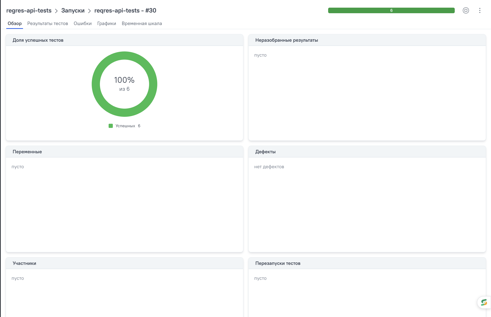

# API Test Automation Project — Reqres.in

<p align="center">
  
</p>

<p align="center">
  API test automation project for testing the Reqres REST API
</p>

<p align="center">
  <a href="https://jenkins.qa.guru/job/reqres-api-tests/">
    <b>Jenkins</b>
  </a>
  •
  <a href="https://jenkins.qa.guru/job/reqres-api-tests/allure/">
    <b>Allure Report</b>
  </a>
  •
  <a href="https://allure.qa.guru/launch/55690">
    <b>Allure TestOps</b>
  </a>
</p>

---

## Contents

* [Description](#description)
* [Technologies and Tools](#technologies-and-tools)
* [Implemented Tests](#implemented-tests)
* [Project Structure](#project-structure)
* [Running Tests](#running-tests)
* [Jenkins CI](#jenkins-ci)
* [Allure Report](#allure-report)
  * [Allure Overview](#allure-overview)
  * [Test Details](#test-details)
* [Allure TestOps](#allure-testops)
* [Telegram Notifications](#telegram-notifications)
* [API Key](#api-key)
* [Author](#author)

---

## Description

Reqres API Test Automation is a project for automated testing of the REST API provided by [Reqres.in](https://reqres.in).

The project covers the main user-related API operations: creating, retrieving, updating and deleting users, as well as negative scenarios.

### Project Features

* API tests written in `Java`
* HTTP requests and response validation using `REST Assured`
* Test execution with `JUnit 5`
* Project build and dependency management with `Gradle`
* Request and response models using `Lombok`
* JSON serialization and deserialization using `Jackson`
* Reusable `RequestSpecification` and `ResponseSpecification`
* Positive and negative API scenarios
* `Allure REST Assured` listener
* Custom `FreeMarker` templates for HTTP request and response attachments
* Allure metadata:
  * Epic
  * Feature
  * Story
  * Severity
  * Owner
* Automated execution through `Jenkins`
* Secrets stored in `Jenkins Credentials`
* Automatic Allure Report generation
* Integration with `Allure TestOps`
* Automatic Telegram notifications after Jenkins builds
* Test statistics and result chart sent to Telegram

---

## Technologies and Tools

<p align="center">
  <a href="https://www.java.com/">
    
  </a>
  &nbsp;&nbsp;

  <a href="https://gradle.org/">
    
  </a>
  &nbsp;&nbsp;

  <a href="https://jenkins.qa.guru/job/reqres-api-tests/">
    
  </a>
  &nbsp;&nbsp;

  <a href="https://git-scm.com/">
    
  </a>
  &nbsp;&nbsp;

  <a href="https://github.com/">
    
  </a>
  &nbsp;&nbsp;

  <a href="https://www.jetbrains.com/idea/">
    
  </a>
</p>

<p align="center">
  <b>REST Assured</b> •
  <b>JUnit 5</b> •
  <b>Allure Report</b> •
  <b>Allure TestOps</b> •
  <b>Lombok</b> •
  <b>Jackson</b> •
  <b>FreeMarker</b> •
  <b>Telegram Bot API</b>
</p>

---

## Implemented Tests

The project contains automated tests for the main Reqres user API operations.

### POST /users

* Create a new user
* Validate `201 Created`
* Deserialize response into DTO
* Validate created user data

### GET /users

* Get users list
* Validate response status
* Deserialize users collection
* Validate returned user data

### GET /users/2

* Get a single user
* Validate `200 OK`
* Validate user information

### GET /users/99999

* Request a non-existing user
* Validate `404 Not Found`

### PUT /users/2

* Update user information
* Validate `200 OK`
* Validate updated response

### DELETE /users/2

* Delete user
* Validate `204 No Content`

### Current Test Suite

```text
Total tests: 6
Passed: 6
Failed: 0
```

---

## Project Structure

```text
reqres-api-tests
├── images
│   ├── reqres-logo.png
│   ├── allure-overview.png
│   ├── allure-test-details.png
│   ├── allure-testops.png
│   ├── jenkins-allure.png
│   └── telegram-report.png
│
├── notifications
│   └── telegram.json
│
├── src
│   └── test
│       ├── java
│       │   └── qa
│       │       └── guru
│       │           └── reqres
│       │               ├── models
│       │               │   ├── CreateUserRequestDto.java
│       │               │   ├── CreateUserResponseDto.java
│       │               │   ├── UpdateUserRequestDto.java
│       │               │   ├── UpdateUserResponseDto.java
│       │               │   ├── UserDto.java
│       │               │   └── UserSearchResponseDto.java
│       │               │
│       │               ├── specs
│       │               │   └── ReqresSpec.java
│       │               │
│       │               └── tests
│       │                   ├── TestBase.java
│       │                   └── ReqresApiTests.java
│       │
│       └── resources
│           ├── tpl
│           │   ├── request.ftl
│           │   └── response.ftl
│           │
│           └── allure.properties
│
├── build.gradle
├── gradlew
├── gradlew.bat
├── settings.gradle
└── README.md
```

---

## Running Tests

### Local Test Execution

Before running the tests, configure the Reqres API key:

```bash
export REQRES_API_KEY=YOUR_API_KEY
```

Run all tests:

```bash
./gradlew clean test
```

### Generate Allure Report

```bash
./gradlew allureReport
```

### Open Allure Report

```bash
./gradlew allureServe
```

---

## Jenkins CI

The project is integrated with Jenkins for automated test execution.

<p align="center">
  <a href="https://jenkins.qa.guru/job/reqres-api-tests/">
    <b>Open Jenkins Job</b>
  </a>
</p>

### Jenkins CI Flow

```text
GitHub
   ↓
Jenkins
   ↓
Gradle
   ↓
API Tests
   ↓
Allure Results
   ↓
Allure Report
   ↓
Allure TestOps
   ↓
Telegram Notification
```

The CI process:

* Downloads the project from GitHub
* Loads secrets from Jenkins Credentials
* Executes API tests
* Collects test execution results
* Generates an Allure Report
* Sends test results to Allure TestOps
* Generates a test result chart
* Sends execution results to Telegram

### Jenkins Credentials

The following secrets are stored in Jenkins and are not committed to GitHub:

```text
REQRES_API_KEY
TELEGRAM_BOT_TOKEN
TELEGRAM_CHAT_ID
```

### Jenkins Build

<p align="center">
  <a href="https://jenkins.qa.guru/job/reqres-api-tests/">
    
  </a>
</p>

<p align="center">
  <a href="https://jenkins.qa.guru/job/reqres-api-tests/">
    <b>Open Jenkins Job</b>
  </a>
</p>

---

## Allure Report

The project is integrated with Allure Report.

Allure REST Assured automatically attaches HTTP request and response details to test results.

Custom FreeMarker templates are used:

```text
src/test/resources/tpl/request.ftl
src/test/resources/tpl/response.ftl
```

The report contains:

* Test status
* Test duration
* Epic
* Feature
* Story
* Severity
* Owner
* HTTP request
* HTTP response
* Response status code

<p align="center">
  <a href="https://jenkins.qa.guru/job/reqres-api-tests/allure/">
    <b>Open Allure Report</b>
  </a>
</p>

### Allure Overview

<p align="center">
  <a href="https://jenkins.qa.guru/job/reqres-api-tests/allure/">
    
  </a>
</p>

### Test Details

<p align="center">
  <a href="https://jenkins.qa.guru/job/reqres-api-tests/allure/">
    
  </a>
</p>

---

## Allure TestOps

The project is integrated with Allure TestOps for centralized test result management and test execution analysis.

Test results generated during Jenkins builds are uploaded to Allure TestOps.

Allure TestOps provides:

* Centralized test execution history
* Test launch management
* Passed, failed and skipped test statistics
* Test duration and execution details
* Allure metadata such as Epic, Feature, Story, Severity and Owner
* HTTP request and response attachments
* Integration with Jenkins CI
* Historical test result analysis

### Allure TestOps Launch

<p align="center">
  <a href="https://allure.qa.guru/launch/55690">
    
  </a>
</p>

<p align="center">
  <a href="https://allure.qa.guru/launch/55690">
    <b>Open Allure TestOps</b>
  </a>
</p>

---

## Telegram Notifications

After Jenkins finishes the build, the execution results are automatically sent to Telegram.

The notification contains:

* Environment
* Test execution information
* Total number of scenarios
* Passed tests
* Failed tests
* Skipped tests
* Pass percentage
* Test result chart
* Link to the Allure Report

### Telegram Report

<p align="center">
  
</p>

Example:

```text
Reqres API Tests

Results:
Environment: main
Comment: Regression run

Total scenarios: 6
Total passed: 6 (100%)
Total failed: 0
Total skipped: 0
```

---

## API Key

Reqres requires an API key for API requests.

The real API key is not stored in the repository.

For local execution:

```bash
export REQRES_API_KEY=YOUR_API_KEY
```

For Jenkins execution, the API key is stored securely in Jenkins Credentials.

---

## Author

**Aikerim**

QA Automation Engineer