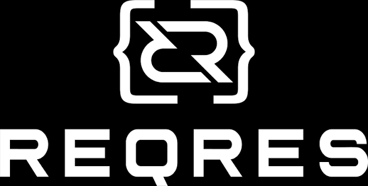
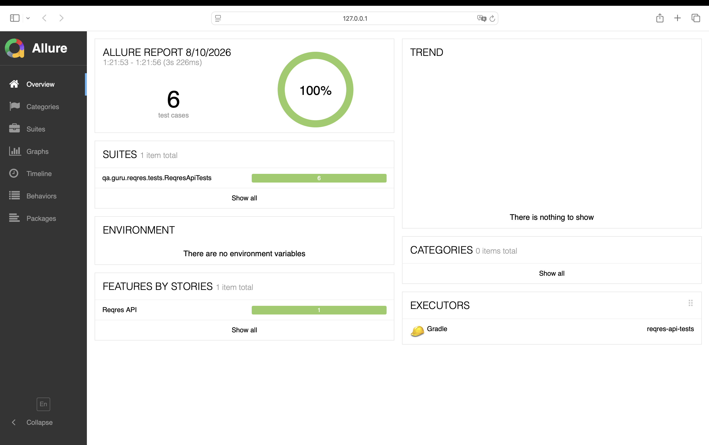
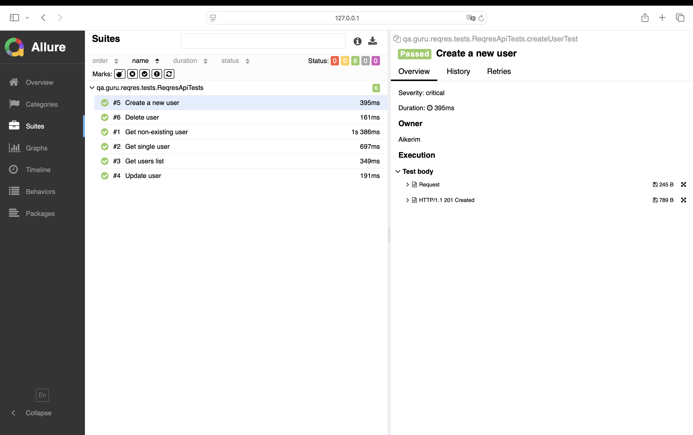

# API Test Automation Project — Reqres

<p align="center">
  
</p>

API test automation project for Reqres API using Java, REST Assured, JUnit 5 and Allure Report.

## Technology Stack
## Technology Stack

- Java
- Gradle
- REST Assured
- JUnit 5
- Jackson
- Lombok
- Allure Report
- Allure REST Assured
- Git

## Test Coverage

The project contains automated tests for basic user management API operations.

| Test | Method | Endpoint | Expected Status |
|---|---|---|---|
| Create a new user | POST | `/users` | 201 |
| Get users list | GET | `/users` | 200 |
| Get single user | GET | `/users/2` | 200 |
| Get non-existing user | GET | `/users/99999` | 404 |
| Update user | PUT | `/users/2` | 200 |
| Delete user | DELETE | `/users/2` | 204 |

The suite includes both positive and negative API scenarios.

## Project Structure

```text
src
└── test
    ├── java
    │   └── qa.guru.reqres
    │       ├── models
    │       │   ├── CreateUserRequestDto.java
    │       │   ├── CreateUserResponseDto.java
    │       │   ├── UpdateUserRequestDto.java
    │       │   ├── UpdateUserResponseDto.java
    │       │   ├── UserDto.java
    │       │   └── UserSearchResponseDto.java
    │       │
    │       ├── specs
    │       │   └── ReqresSpec.java
    │       │
    │       └── tests
    │           └── ReqresApiTests.java
    │
    └── resources
        ├── tpl
        │   ├── request.ftl
        │   └── response.ftl
        │
        └── allure.properties
```

## Models

DTO models are used for request serialization and response deserialization.

Lombok is used to reduce boilerplate code, while Jackson handles JSON mapping between API responses and Java objects.

Example:

```java
@Data
@NoArgsConstructor
@AllArgsConstructor
public class CreateUserRequestDto {

    private String name;
    private String job;
}
```

## Specifications

Common REST Assured configuration is extracted into reusable request and response specifications.

This keeps API tests clean and avoids configuration duplication.

```java
given()
        .spec(requestSpec)
.when()
        .get("/users/2")
.then()
        .spec(responseSpec)
        .statusCode(200);
```

## Allure Report

The project is integrated with Allure Report.

Allure REST Assured integration automatically attaches HTTP request and response information to test results.

Custom Freemarker templates are used for REST Assured attachments:

```text
src/test/resources/tpl/request.ftl
src/test/resources/tpl/response.ftl
```

Tests also contain Allure metadata such as:

- Epic
- Feature
- Story
- Severity
- Owner

### Allure Report Overview



### Test Details



## Running Tests

Run all tests:

```bash
./gradlew clean test
```

## API Key

## API Key

Reqres requires an API key for requests.

The API key should not be committed to the repository.

Configure your API key according to the project configuration before running the tests.

Example:

```bash
export REQRES_API_KEY=free_user_3HgoK6zjcXsPkjzRyV2g2eD17p9
./gradlew clean test
```

> Never commit a real API key to GitHub.

## Generate Allure Report

Generate the report:

```bash
./gradlew allureReport
```

Open the report:

```bash
./gradlew allureServe
```

## Test Report

The test suite contains 6 automated API tests covering positive and negative scenarios.

All tests can be viewed in Allure Report together with request and response attachments.

## Author

Aikerim

QA Automation Engineer